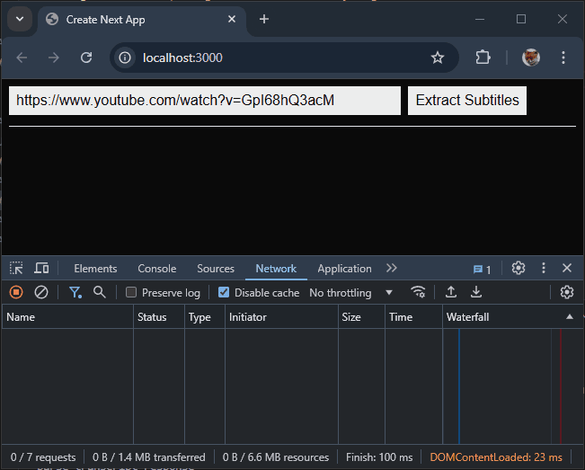

# uweyvs (Upwork Extract YouTube Video Subtitles)
I try to extract setup youtube video captions extraction with official api (project in VS 2022 .NET8 webapi). But I keep getting issue with wrong redirect URI. I already experimented with setup in Google Console however no success. I guess need some sophisticated processing of autorization with OAuth2 for this case. So I need source code of method authorizing with oauth2 and getting captions afterwards.

Preivously I tryed with youtubexplode nuget package, however currenlt it doesnt work (google bans its requests for most ids)

If you know some other working way to get youtube video subtitles - we can also discuss it. Even it is not in c#

p.s. ideally if you recently donу this job.

## Instructions
```bash
git clone https://github.com/PD-22/uweyvs.git
cd uweyvs
npm install
npm run dev
```

## Demonstration

